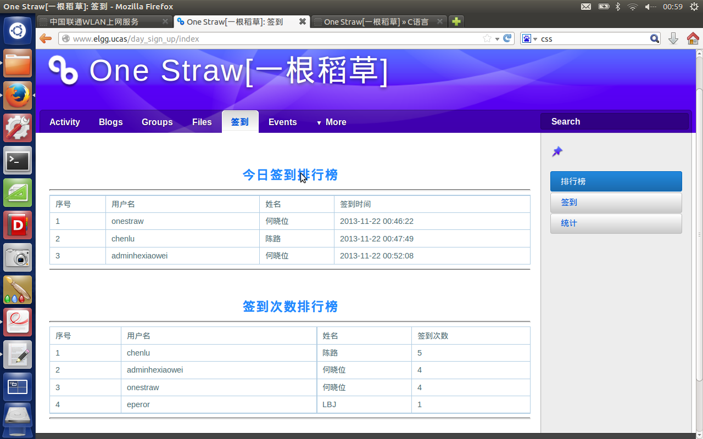
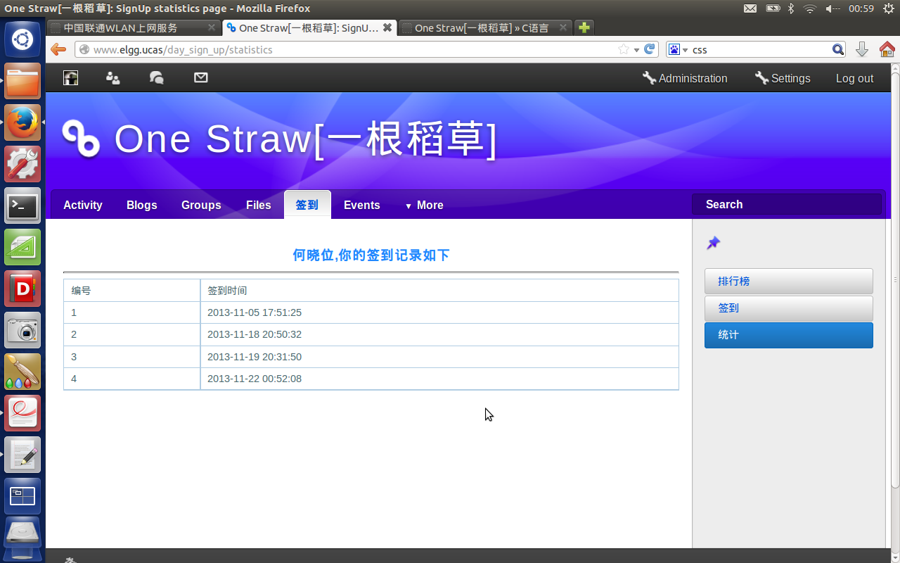

****
Author: geeksword  
Email: geeksword@163.com  
Last Modified: 2013/11
****   

1.本插件基于elgg1.8开发； 
2.插件功能：签到考勤、每日签到排行、历史签到次数排行、个人签到历史记录查询； 
3.使用方法： 
	1)创建数据库表  
	Create table Elgg_daily_attendance(  
		id BIGINT(20) PRIMARY KEY NO NULL AUTO_INCREMENT,  
		guid BIGINT(20) NOT NULL,  
		sign_up_time DATETIME NOT NULL,  
		foreign key(id) references Elgg_users_entity(guid) on delete cascade  
	);  
	2)将day_sign_up解压到elgg/mod目录下，在浏览器中打开elgg管理界面，激活day_sign_up插件。 

	 
	